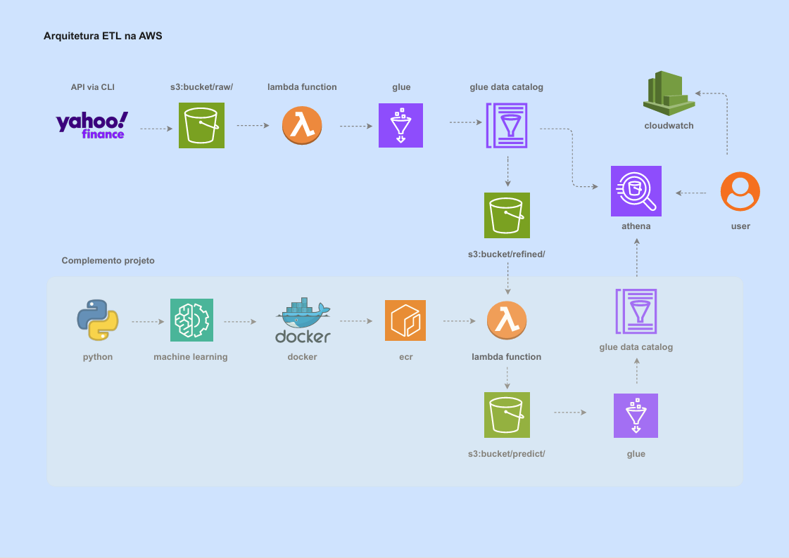

# Tech Challenge ML Engineer - Fase 2 - ETL na AWS

This project was developed as part of the Phase 3 Tech Challenge, focusing on Order Cycle Time (OCT) prediction using Amazon Delivery data.<br>
O projeto $\text{etl\_na\_aws}$ implementa uma arquitetura ETL (Extract, Transform, Load) e um fluxo de MLOps completamente serverless na Amazon Web Services (AWS). 

## 🚀 Application and Experiment Tracking

Access the live application and the full history of model experiments using the links below.

| **Tool**                   | **Status**     | **Link** |
|-----------------------------|----------------|-----------|
| Active Forecasting App      | 🟢 Deployed     | [Open App](https://example.com) |
| MLflow Experiment Tracking  | 📊 Monitoring   | [View Dashboard](https://dagshub.com/projeto5mlet/amazon_last_mile_delivery.mlflow) |

## 🏗️ Project Architecture
The architecture illustrates the data flow from raw ingestion, through feature engineering and model training, to the final deployment and tracking services.




## 🎯 Project Objective

- **OTD Prediction** = The total time elapsed from the moment in which the order is input into the system until its final delivery at the customer's location in minutes.<br>
This prediction is crucial for ensuring the deliveries meet the minimum Service Level Agreement (SLA) of 120 minutes, thereby directly impacting customer satisfaction and logistics efficiency.


## 📊 Dataset and Simulation

The **Amazon Delivery Dataset** provides a comprehensive view of last-mile logistics operations, including:
- **43,632 deliveries** across multiple cities
- Order details and delivery agents information
- Weather and traffic conditions
- Delivery performance metrics

We also utilized Simpy for discrete-event simulation to model and analyze various scenarios related to delivery performance.

## 📁 Repository Architecture

```
├── data/                       # Raw and processed data
│   ├── raw/                    # Original data from Kaggle
│   └── processed/              # Cleaned and transformed data
│   └── simulation/             # Simulation results
├── notebooks/                  # Notebooks
│   ├── 02_EDA                  # Exploratory Data Analysis (EDA)
│   ├── 02_MODEL_VALIDATION     # ML Process Analysis
│   └── 02_SIMULATION.ipynb     # Simulation Data Analysis
├── reports/                    # Reports and figures
│   ├── figures/models/         # Images Plots from Model Validation
├── src/                        # Project source code
│   ├── config/                 # Configuration files
│   ├── data/                   # Processing modules
│   ├── features/               # Feature Engineering modules
│   ├── modeling/               # ML training modules
│   ├── models/                 # Models files
│   ├── utils/                  # Utilities modules
│   └── visualization/          # Visualizations
├── tests/                      # Project tests
├── app.py                      # Streamlit app
├── otd_simulator.py            # Simpy script
├── project.toml                # Poetry config files
└── requirements.txt            # Requirements
```

## 🚀 Implemented Features

### 1. **Data Pipeline**
- ✅ Data collection from Kaggle
- ✅ Data processing and cleaning
- ✅ Storage in organized structure
- ✅ Categorical variable mappings

### 2. **Machine Learning Model**
- ✅ Exploratory Data Analysis (EDA)
- ✅ Feature Engineering
- ✅ Training with LightGBM
- ✅ Experiment tracking with MLflow
- ✅ MlFlow for experiment and versioning


### 3. **User Interface**
- ✅ Interactive dashboard in Streamlit
- ✅ Data and results visualizations
- ✅ Real-time prediction interface
- ✅ Simpy Last Mile simulation

## 🛠️ Technologies Used

- **Python 3.11.x**
- **Pandas & NumPy** for data manipulation
- **Statsmodels & Scipy** for statistics
- **Scikit-learn** for ML pipeline
- **LightGBM** for ML modeling
- **Shap** for feature importances
- **MLflow** for experiment tracking
- **Streamlit** for interactive dashboard
- **Matplotlib, Seaborn & Plotly** for visualizations
- **Simpy** for simulation

## ⚙️ Setup and Installation

### Prerequisites
- Python 3.11.x
- Conda installed globally
- Poetry installed globally

### Step by step:

**Environment Variables Setup (Critical)**
1. Create an account at https://dagshub.com/ and generate a token from your profile settings.
2. You must set up your environment variables (including DAGsHub credentials and MLflow URI) before installing dependencies.

**Option 1: Installation via Conda and pip (Recommended)**
1. **Clone the repository:**
```bash
git clone https://github.com/IgorComune/tech_challenge_ml_engineer_phase3.git
cd tech_challenge_ml_engineer_phase3
```

2. **Create a conda environment:**
```bash
conda create -n tech_challenge python=3.11.9
conda activate tech_challenge
```

3. **Install dependencies:**
```bash
pip install -r requirements.txt
```

4. **Run the project:**
**Streamlit Dashboard:**
```bash
streamlit run app.py
```

**Option 2: Installation via Poetry**
1. **Clone the repository:**
```bash
git clone [https://github.com/IgorComune/tech_challenge_ml_engineer_phase3.git](https://github.com/IgorComune/tech_challenge_ml_engineer_phase3.git)
cd tech_challenge_ml_engineer_phase3
```

2. **Install dependencies and create the Poetry virtual environment:**
```bash
# This command automatically reads pyproject.toml, creates the .venv (virtual environment), and installs all dependencies.
poetry install
```

3. **Activate the environment:**
```bash
# This command spawns a shell in the project's virtual environment.
poetry shell
```

4. **Running the Project:**
**Streamlit Dashboard:**
```bash
streamlit run app.py
```

## 📈 Results and Insights

### Business Impact
- Improvement in on-Time Delivery (OTD) SLA (120 minutes) rate from 41% to 70% with Predictive model and corrective real-time actions.

### Exploratory Analysis
- Identification of key delivery patterns based on categorical features.
- Development of new predictive features based on categorical patterns and statistics test.
- Correlation between weather conditions and delivery time
- Traffic impact on logistics performance.

### Model Performance
- LightGBM model for OTD prediction
- Evaluation metrics available in MLflow
- Feature importance visualization with Shap

### Interactive Dashboard
- User-friendly interface for data analysis
- Real-time predictions
- Interactive result visualizations

### Simulation Last Mile Process
- Implementation of politics in real-time logistics (e.g., re-routing, agent reassignment), resulting in a measurable uplift in On-Time Delivery (OTD) performance.

## 📁 Data Structure

### Processed Data:
- `amazon_delivery_processed.csv` - Complete processed dataset

### Models:
- `models:/LightGBM_Ajustado/Production` - Versioned LightGBM

## 🧪 Testing and Validation
- Test notebooks available in `tests/`

## 🤝 Contribution

This project was developed as part of Phase 3 Tech Challenge. Feedback and suggestions are welcome!

## 📄 License

This project is under the license specified in the `LICENSE` file.

---

**Project:** Tech Challenge ML Engineer - Phase 3  
**Institution:** Pós-Tech

---

*"Transforming data into insights, insights into value."*
